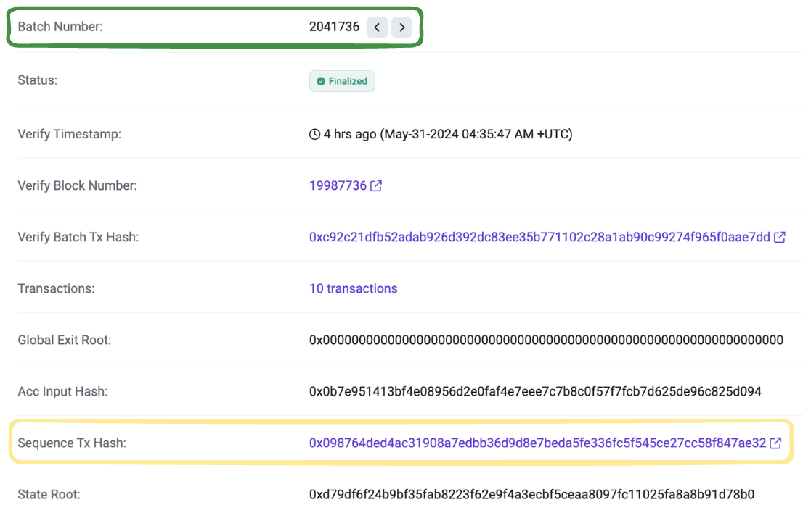

# Batches, blocks, and transactions

The following concepts are key to understanding how transactions are handled on L2s built with the CDK:

- Transaction: Signed instruction to perform an action on the blockchain.
- Block: A group of transactions and a hash of the previous block in the chain.
- Batch: A group of many transactions from multiple blocks.

See the figure below to best understand how these concepts relate to each other. We follow a real transaction from the Polygon zkEVM to track how it first gets included in a block on the L2, then a batch, and finally, a sequence sent to Ethereum.

## Transaction

A transaction is a cryptographically signed instruction from an account to update the state of the blockchain. Users can leverage familiar tools and libraries, like MetaMask and Ethers.js, typically used for interacting with Ethereum, to send these transactions to CDK-built L2 chains.

Transactions are included in blocks, and these blocks fill batches. Consider a Polygon zkEVM transaction as an example, [`0xdd`](https://zkevm.polygonscan.com/tx/0xdd3f79c24886310ddf868ad1d36aadc6a3b6495048f68aad765c658c42426ef8), which performs a `Simple Swap` function call, and is included in block number [`12952601`](https://zkevm.polygonscan.com/block/12952601) on the L2.

## Block

To link blocks together, blocks contain multiple transactions as well as the hash of the previous block in the chain. Following the transaction example from above, the `0xdd` transaction is included in block [`12952601`](https://zkevm.polygonscan.com/block/12952601), which contains [2 transactions in total](https://zkevm.polygonscan.com/txs?block=12952601).

We can see this `0xdd` transaction is included in both a block and a batch, specifically, it is included in the block `12952601` and the batch `2041736`:

## Batch

Batches contain multiple transactions from multiple blocks. The two transactions from our example block `12952601` are included in batch [`2041736`](https://zkevm.polygonscan.com/batch/2041736), which contains [10 total transactions](https://zkevm.polygonscan.com/txs?batch=2041736).

This means the batch `2041736` includes the two transactions from block `12952601` as well as eight transactions from other blocks.

The presence of the `Sequence Tx Hash` field, associated with this batch, indicates that this batch has been sent to Ethereum along with other batches in a single transaction.

By inspecting the transactions in the batch, we can see:

- Our original transaction example is included in this batch.
- The batch contains many transactions from different blocks.

If the L2 is a [rollup](./layer2s.md) (meaning it uses Ethereum for it&rsquo;s [data availability](https://docs.polygon.technology/cdk/glossary/#data-availability)), it sends an array of batches to Ethereum, by providing the array as an argument to the `sequenceBatches` function of a smart contract on Ethereum.

By inspecting the `Sequence Tx Hash` transaction, we can see that the `sequenceBatches` function is called with the array of batches as an argument. One of these batches is the batch we have been following, `2041736`, which contains our original transaction example:

## Further reading

- [Blocks in the zkEVM Etrog Upgrade](https://docs.polygon.technology/zkEVM/architecture/protocol/etrog-upgrade/?h=blocks#etrog-blocks)