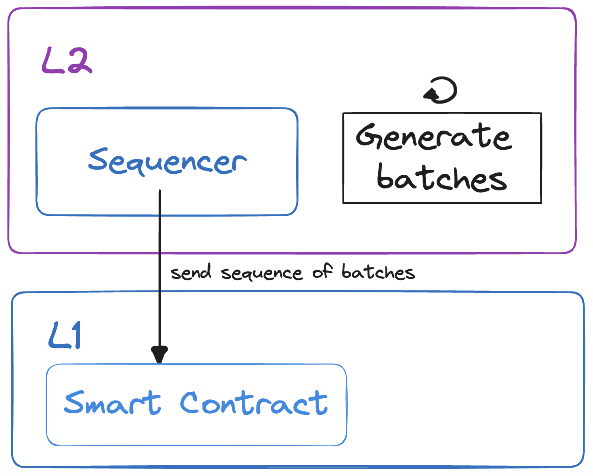
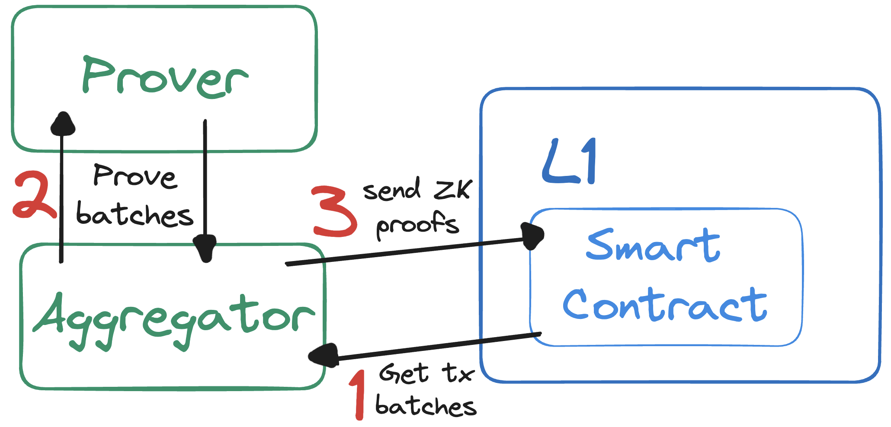

# Transaction lifecycle

Transactions on  CDK-built chains go through a series of steps to eventually reach [finality](./transaction-finality.md) on Ethereum.
Specifically, they go through the following steps:

1. Submitted: The transaction is submitted to the L2.
2. Executed: The transaction is executed on the L2 by the sequencer.
3. Batched: The transaction is included in a batch of transactions.
4. Sequenced: The batch containing the transaction is sent to Ethereum.
5. Aggregated: A ZK-proof is generated, posted, and verified on Ethereum to prove the transaction is valid.

## Submitted

Similar to Ethereum, users submit transactions to a &ldquo;pool&rdquo; of pending transactions on the L2. The transaction is submitted using the same interface as on Ethereum, via [JSON-RPC](https://ethereum.org/en/developers/docs/apis/json-rpc/) which is implemented by wallets such as MetaMask and developer libraries such as Ethers.js.

## Executed

The [sequencer](./architecture.md#sequencer) reads transactions from the pending transaction pool and executes them on the L2. Once executed, transactions are added to [blocks](./blocks.md#block), then the blocks fill [batches](./blocks.md#batch), and the sequencer’s local L2 state is updated.

Once the state is updated, it is also broadcast to all other zkEVM nodes which provide the transaction information back to the user or application that submitted the transaction.

At this point, the transaction appears complete to users, as they are provided with the result of whether the transaction was executed or reverted. Users can continue to interact with the chain with the updated state.

## Batched

As a background process, the [sequencer](./architecture.md#sequencer) is constantly creating [batches](./blocks.md#batch) of transactions. These batches contain multiple transactions from multiple [blocks](./blocks.md#block) on the L2.

One field in the batch data structure is `transactions`, which contains a [`bytes`](https://docs.soliditylang.org/en/latest/types.html#bytes-and-string-as-arrays) representation of the transactions in the batch. This is generated by serializing each transaction in the batch using [RLP serialization](https://ethereum.org/en/developers/docs/data-structures-and-encoding/rlp/) and then concatenating them together.

## Sequenced

Depending on the data availability design choices of the L2, if the L2 is a [rollup](./rollup-vs-validium.md#rollups), the sequencer sends arrays of batches to the [L1 smart contract](./architecture.md#l1-smart-contracts), where they are stored inside the state of the smart contract.

## Aggregated

The final step of the transaction lifecycle is to generate a ZK-proof that proves the batch of transactions is valid. Batches of transactions are read by the [aggregator](./architecture.md#aggregator) which utilizes a [prover](./architecture.md#prover) to generate a ZK-proof that is posted back to Ethereum.

## Further reading

- [zkEVM transaction lifecycle documentation](https://docs.polygon.technology/zkEVM/architecture/protocol/transaction-life-cycle/submit-transaction/)